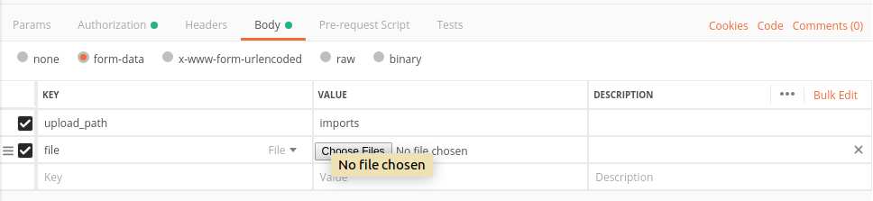

# Vicoders Core Component for Laravel

- [Vicoders Core Component for Laravel](#vicoders-core-component-for-laravel)
	- [Installation](#installation)
		- [Composer](#composer)
		- [Config and Migration](#config-and-migration)
		- [Environment](#environment)
	- [Apis](#apis)
				- [Header](#header)
				- [Request](#request)
			- [FileValidator](#filevalidator)
	- [Exceptions](#exceptions)
	- [Validators](#validators)

This package contains 3 other packages which are `dingo/api`, `tymon/jwt-auth`, `prettus/l5-repository` that provides powerful codebase to build Apis.

## Installation

### Composer

To include the package in your project, Please run following command.

```
composer require vicoders/core
```

### Config and Migration

Run the following commands to publish configuration and migration files.

```
php artisan vendor:publish --provider="Dingo\Api\Provider\LaravelServiceProvider"
php artisan vendor:publish --provider="Tymon\JWTAuth\Providers\LaravelServiceProvider"
php artisan vendor:publish --provider "Prettus\Repository\Providers\RepositoryServiceProvider"
```

### Environment

In .env file, we need some configuration.

```
API_PREFIX=api
API_VERSION=v1
API_NAME="Your API Name"
API_DEBUG=false
```

Generate JWT_SECRET in .envfile.

```
php artisan jwt:secret
```

## Apis

`Vicoders/Core` package provides a base `VCComponent\Laravel\Vicoders\Core\Controllers\ApiController` and upload file api in `VCComponent\Laravel\Vicoders\Core\Controllers\FileController`

```
{url}/api/file/upload
```

> Upload file api have `POST` HTTP method.

Modify `config/filesystems.php` to use the api:

```php
'disks' => [
		'local' => [
				'driver' => 'local',
				'root' => public_path(),
		],
```

To use this api, please add the following params into the request:

##### Header


##### Request



#### FileValidator

You are free to use your own `FileValidator`. Just implements `FileValidatorInterface` in your validator and bind it in `AppServiceProvider`.

```php
<?php

namespace App\Providers;

use App\Validators\FileValidator;
use Illuminate\Support\ServiceProvider;
use VCComponent\Laravel\Vicoders\Core\Contracts\FileValidatorInterface;

class AppServiceProvider extends ServiceProvider
{
    /**
     * Register any application services.
     *
     * @return void
     */
    public function register()
    {
        $this->app->bind(FileValidatorInterface::class, FileValidator::class);
    }
}
```

```php
<?php

namespace App\Validators;

use VCComponent\Laravel\Vicoders\Core\Contracts\FileValidatorInterface;
use VCComponent\Laravel\Vicoders\Core\Validators\AbstractValidator;

class FileValidator extends AbstractValidator implements FileValidatorInterface
{

    protected $rules = [
        'RULE_CREATE' => [
            'file'        => ['required', 'mimes:csv'],
            'upload_path' => ['required', 'regex:/[a-z]*/'],
        ],
    ];
}
```

## Exceptions

`Vicoders/Core` package provides some commonly used `Exception` class:

```php
VCComponent\Laravel\Vicoders\Core\Exceptions\NotFoundException::class,
VCComponent\Laravel\Vicoders\Core\Exceptions\PermissionDeniedException::class,
```

You can use these `Exception` classes in your `Controller`:

```php
use VCComponent\Laravel\Vicoders\Core\Exceptions\NotFoundException;
use VCComponent\Laravel\Vicoders\Core\Controllers\ApiController;

class UserController extends ApiController
{
	public function show(Request $request, $id)
	{
		$user = $this->entity->find($id);
		if (!$user) {
			throw new NotFoundException('User');
		}
	}
}
```

## Validators

`Vicoders/Core` package provides some an `AbstractValidator` that you can use to create your `Validator` class:

```php
use VCComponent\Laravel\Vicoders\Core\Validators\AbstractValidator;

class PostValidator extends AbstractValidator
```
